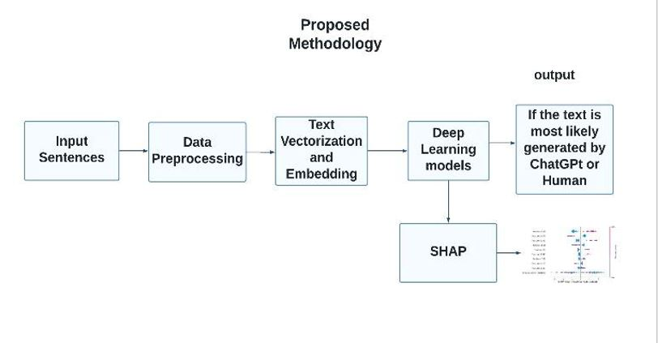
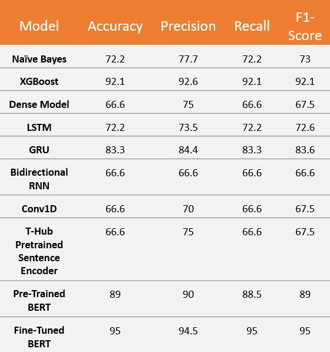
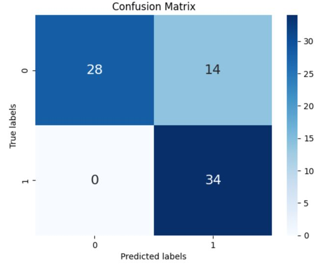

# Recognizing-Automated-Text-from-Human-Written-Text-using-Deep-Learning
Develop a Deep Learning Model which can distinguish text generated by ChatGPT from human written text.

## Introduction

ChatGPT is used by millions of users all over the word. it is free to use and helpful but can also be misused. The ability to detect AI-generated text is essential for identifying and protecting against malicious use of AI, such as the spread of misinformation and disinformation, or social engineering attacks. The goal is to develop a machine learning model that can differentiate between Automated text generated by ChatGPT and human written text. Advanced Natural Language Models like transformers are used.

## Datasets

Dataset – 1 – contains TOFEL essays – 126 human, 126 ChatGPT generated [1]   
Dataset – 2 – Dataset for training models to classify human written vs GPT/ChatGPT  generated text. This dataset contains Wikipedia introductions and GPT (Curie) generated introductions for 150k topics.[2]
Dataset – 3 - ChatGPT Paraphrases - dataset of paraphrases created by ChatGPT for 150k topics.[3]

## Methodology

Data Pre-Processing: 
 - Removing Punctuation
 - Convert to Lower Case
 - Tokenization
 - Embedding

Text Vectorization  
Embedding

SHAP: SHAP aids in model refinement by identifying influential features, fostering both the development of more robust models and the enhancement of domain-specific insights.

Deep Learning Models:
- Dense network.
- LSTM
- GRU
- Bi-LSTM
- Conv1D
- T-Hub Pretrained Sentence Encoder
- BERT
- RoBERTa

Classic Machine Learning Models:
- Naive Bayes
- XGBoost

Evaluation Metrics
- Accuracy
- Precision
- Recall
- F1-Score

## Results

### Dataset 1

Key Takeaways:
- XGBoost performs better than LSTM, GRU, Bi-LSTM

Why XGBOOST might perform well:
Sequential Data Advantage: LSTMs, Bi-LSTMs, and GRUs are specialized for sequential data (like time series or text). If the patterns in the dataset do not strongly benefit from sequential processing, the advantages of these models may not be fully realized, while XGBoost can still capture relevant patterns.

- Bi-LSTM did not perform well
Dataset Size and Complexity: BiLSTMs effectively double the parameters because they process the data in both directions. If the dataset is not large enough to support the learning of these additional parameters, a BiLSTM can overfit more easily compared to GRUs and LSTMs.

- Pre-TRained BERT did not perform better than XGBoost
While pre-trained BERT models are extremely powerful, they can be overkill for some datasets, and their complexity doesn't always translate to better performance, especially if the dataset doesn't have enough examples for fine-tuning.

Confusion Matrix for Fine-Tuned BERT on Dataset – 1 (76 records)

image 3

SHAP – Beeswarm plot for XGBoost Model – Dataset 1

image 4

Features on the left-hand side the above figure are ‘Conclusion’, ‘like’, ‘overall’, ‘good’, ‘additionally’, ‘sense’, ‘know’, ‘believe’, ‘life’ in the that order, respectively. 

- Words like Conclusion, overall, additionally, sense, overall have contributed to predicting the sentence as ChatGPT generated.

- Words like like, good, life, opinion, day, better have contributed to predicting the sentence as Human generated.

### Dataset 2

image5

Key Takeaways:
- LSTM, GRU, Bi-LSTM perform better than Pre-Trained BERT

Task Specificity: The fine-tuned recurrent models (LSTM, GRU, BiLSTM) might be tailored more specifically to the nuances of the task or the dataset. If the patterns in the data are more temporal or sequential, which recurrent models excel at capturing, they could potentially outperform BERT.

- Fine-Tuned BERT performed the best.

BERT's attention mechanism allows it to focus on relevant parts of the input sequence when making predictions, which can be particularly effective for tasks that require understanding the relationships between distant elements in the text.

Confusion Matrix for Fine-Tuned BERT on Dataset – 2 (60,000 records)

image6

SHAP – Beeswarm plot for XGBoost Model – Dataset 2

image7

Features on the left-hand side the above figure are ‘born’, ‘history’, ‘biography’, ‘including’, ‘life’, ‘later’, ‘died’, ‘early life’, ‘year’ in the that order, respectively. 

- Words like born, including, died, have contributed to predicting the sentence as ChatGPT generated.

- Words like history, biography, like, background, description, plot have contributed to predicting the sentence as Human generated.

### Dataset 3

image8

Key Takeaways:
- LSTM, GRU, Bi-LSTM doesn’t work on small sentences.

Limited Context: Recurrent models like LSTM and GRU are designed to capture long-term dependencies, which are less prominent in shorter sentences. They excel in scenarios where the context spans many words. With shorter sentences, there isn't as much context for these models to utilize, which could limit their effectiveness.

- BERT works on smaller sentences.

Contextual Understanding: BERT's architecture is designed to understand the context of each word within a sentence, so even with shorter texts, it can discern nuances that might be missed by less sophisticated models.

Confusion Matrix for Fine-Tuned BERT on Dataset – 3 (60,000 records)

image9

SHAP – Beeswarm plot for XGBoost Model – Dataset 3

image10

Features on the left-hand side of above figure are ‘best’, ‘explain’, ‘provide’, ‘suggest best’, ‘difference’, ‘ways’, ‘hat’, ‘steps’, ‘like’ in the that order respectively 
 

- Words like explain, hat, provide, steps, suggest, recommended, individuals, recommend have contributed to predicting the sentence as ChatGPT generated.

- Words like best, good, like, difference, know, think ,really, want have contributed to predicting the sentence as Human generated.

## References:
1. Rexshijaku - “TOFEL Essays by students and ChatGPT”- https://github.com/rexshijaku/chatgpt-generated-text-detection-           corpus/tree/main/full_texts/chatgpt, Accessed on June 25, 2023 
2. A. Bhat, "GPT-wiki-intro (Revision 0e458f5)," Hugging Face, June 25 2023. DOI: 10.57967/hf/0326. Available: https://huggingface.co/datasets/aadityaubhat/GPTwiki- intro. [Accessed: June 25, 2023]. 
3. Hugging Face Datasets, "humarin/chatgpt-paraphrases," Hugging Face, June 25. 2023. Available: https://huggingface.co/datasets/humarin/chatgpt- paraphrases, Accessed on: June 25, 2023. 
